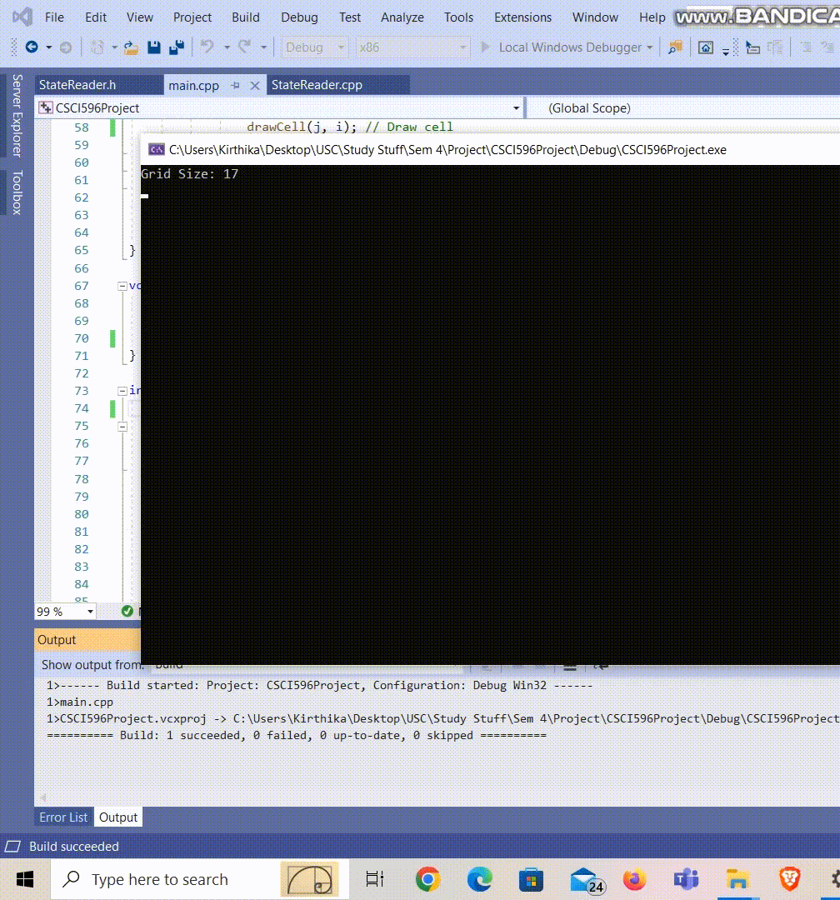
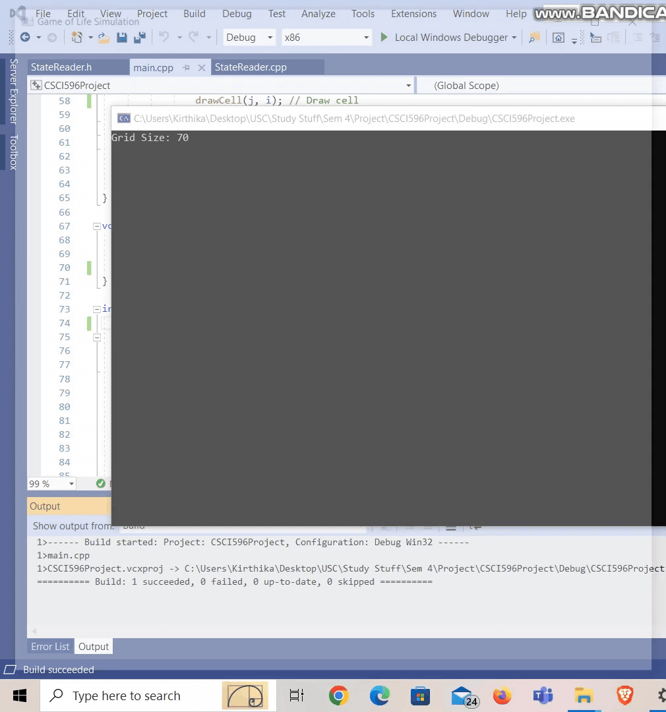
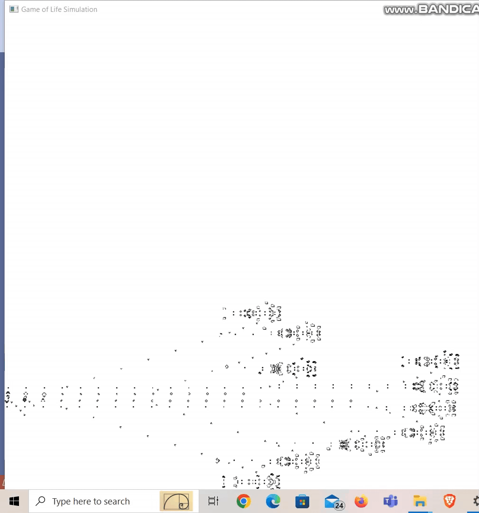
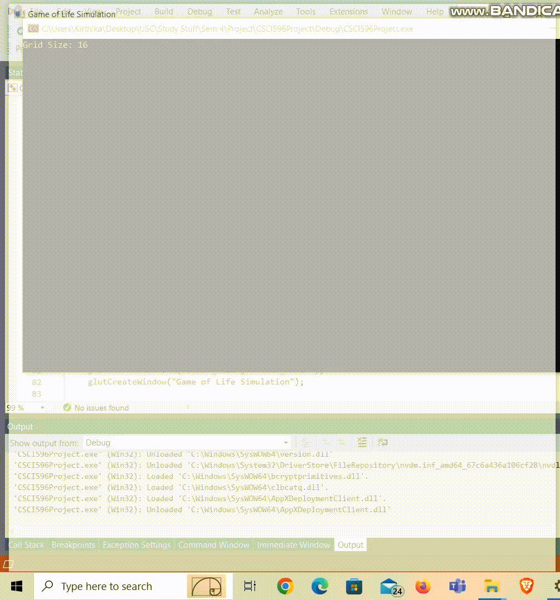
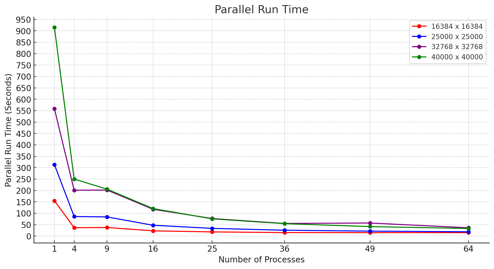
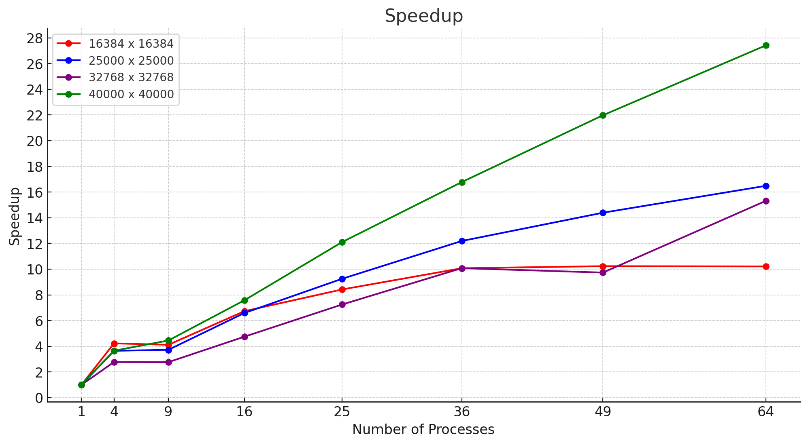
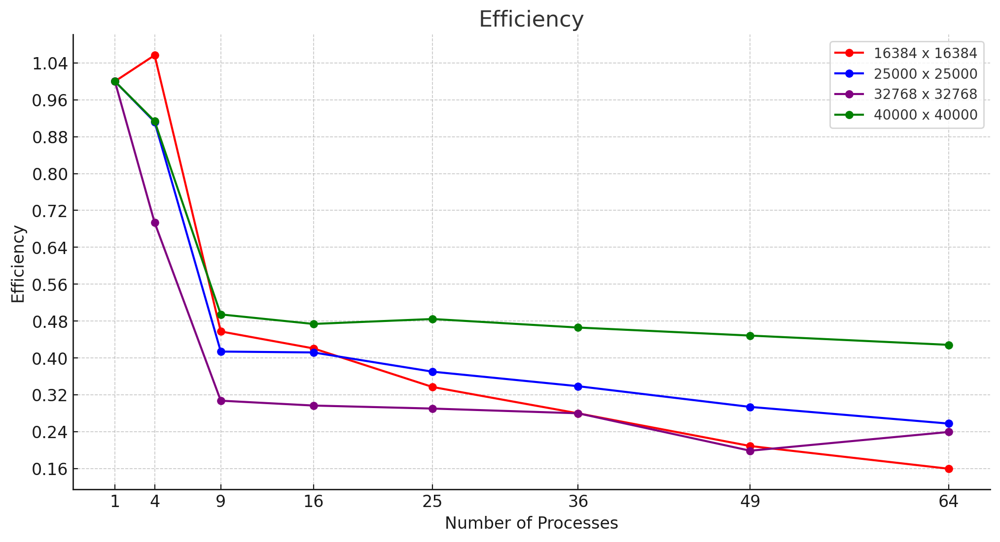

# GameOfLife

## Introduction to Conway's Game Of Life
The Game Of Life is a cellular automation that was designed by John Horton Conway in 1970. It is a game of simulation where the evolution of the world is determined by its initial state, requiring no further input. The game is played on an infinite two-dimensional orthogonal grid of square cells, each in one of two possible states, alive or dead. Every cell interacts with its eight neighbors, which are the cells that are horizontally, vertically, or diagonally adjacent. At each step in time, the following transitions occur:
* Any live cell with fewer than two alive neighbors dies - underpopulation
* Any live cell with more than three alive neighbors dies - overpopulation
* Any dead cell with exactly three alive neighbors becomes a live cell - reproduction
* Any live cell with two or three live neighbors lives on to the next generation

The game is known for its simple rules. Still, its complex and unpredictable behavior demonstrates the fact that simple interactions between individual organisms can give rise to complex and dynamic patterns of life at the population level.

## Our Implementation
We implemented parallelization using MPI and OpenMP. Our program receives a (N x N) grid as input. The grid data (consisting of 0s and 1s) should be arranged as a single row in a plain text file. This means that a 16 x 16 grid  would require a file containing 256 characters.

### Game Execution
Based on the definition of Conway's Game Of Life, we implemented the following rules:
* If a cell is dead *(prev[i][j] != '1')*, and it has exactly 3 live neighbors (alive == 3), it becomes alive in the next generation *(next[i][j] = '1')*
* If a cell is alive *(prev[i][j] == '1')*, and it has fewer than 2 or more than 3 live neighbors, it dies in the next generation *(next[i][j] = '0')*
And we return a flag ('modified') indicating whether the state of the cell was modified.

### MPI
We used MPI to distribute the workload among multiple processes by assigning subgrids to each process to potentially improve performance. We have considered using a perfect square number of processes (Eg: 1, 4, 9, 25, ...) to create a square grid of processes.
- We use ***MPI_Dims_Create*** and ***MPI_Cart_Create*** to create a 2D Cartesian topology of processes. The ***MPI_Cart_Shift*** function is used to find the rank of the neighboring processes and assign as neighbors.
- The input grid is then divided into subgrids based on number of processes, and each process is responsible for executing the rules of the game on its assigned subgrid. Each process by itself calculates the next state of its inner subgrid and sends the outer subgrid to its neighbors. The outer subgrid is received from the neighbors and used to calculate the next state of the outer subgrid.
- ***MPI_Isend*** and ***MPI_Irecv*** are used to asynchronously send and receive from neighboring processes. Each process calculates its inner subgrid values without waiting to receive from its neighbors and only waits to calculate its outer subgrid values.
- The ***MPI_Waitall*** function is used to wait for all the processes to complete the computation before proceeding to the next iteration.
- This is repeated for the number of iterations specified by the user.

### OpenMP
We used the OpenMP directive to parallelize the nested loops in the ***compute_inner*** and ***compute_outer*** functions, distributing the workload among multiple threads to potentially improve performance in a shared-memory parallel computing environment.
- *collapse(2)* is specifically used in the compute_inner function to collapse nested loops into a single loop for more efficient parallelization
- The *schedule(static)* ensures a static (fixed-size) distribution of loop iterations among the threads


## OpenGL Simulations
### Overview
In this documentation, videos of various patterns in Conway's Game of Life are included, all rendered using OpenGL for enhanced graphical representation. These include pattern demonstrations using predefined and random input files across different grid sizes. The focus is on the following primary pattern types:

#### Still Lifes
Stable patterns that do not change over generations symbolizing equilibrium.
Examples: *Block, Beehive, Loaf, Boat*

#### Oscillators
Patterns that return to their initial state after a finite number of generations, depicting periodic behavior.
Examples: *Pulsar*

#### Spaceships
Patterns that move across the grid, maintaining their shape but changing location, demonstrating motion.
Examples: *Glider gun, MSM Breeder*

| Still Lifes | Oscillators | Spaceships |
|:-----------:|:-----------:|:----------:|
|  |  |  |
| | |  |

### Visualization of Patterns with Random Inputs

| Grid Size: 16x16 | Grid Size: 32x32 | Grid Size: 64x64 |
|:----------------:|:----------------:|:----------------:|
|  |  |  |

| Grid Size: 128x128 | Grid Size: 256x256 |
|:------------------:|:------------------:|
|  |  |

## Benchmarking
The simulation of Game of Life is run for 100 iterations for different grid sizes with *1, 2, 4, 8, 16, 32, 64* MPI processes with *2* OpenMP threads per MPI process. The simulation is run on the HPC cluster with the following resource requisition:
```
#SBATCH --nodes=8
#SBATCH --ntasks-per-node=8
#SBATCH --cpus-per-task=2
```
For smaller grid sizes upto *8192x8192*, it was noticed that the serial program outperformed the parallel program. This is because the overhead of parallelization is more than the time taken to run the simulation serially. For larger grid sizes, the parallel program outperformed the serial program. The run times for each grid can be found in *output/runtime_output* folder. The following graphs show the run time, speedup and efficiency for the simulation of Game of Life for different grid sizes and number of MPI processes. 

### Parallel Run Time
Parallel run time is the time taken to run the simulation using MPI and OpenMP.
</img>

### Speedup
Speedup is the ratio of the serial run time to the parallel run time.
</img>

### Efficiency
Efficiency is the ratio of the speedup to the number of MPI processes.
</img>

## Compilation and Execution
### Compilation of MPI and OpenMP source code
In the project directory, run the following command:
```
./build.sh compile
```

The ***build.sh*** script compiles the source code using the following command:
```
mpicc -O -o $OUTPUT_BINARY $SOURCE_FILES -lm -fopenmp
```
The enviroment variables ***OUTPUT_BINARY*** and ***SOURCE_FILES*** are defined in the ***build.sh*** script. The executable named ***game_of_life*** will be created in the bin folder.

The binary and output files can be removed by running:
```
./build.sh clean
```
### Submit job to HPC cluster using SLURM
The ***submit.sl*** file contains the SLURM script to submit the job to the HPC cluster. The script can be modified to change the number of nodes, number of tasks per node, number of threads per task, etc. It uses the following command to run the simulation:
```
mpirun -bind-to none -n no_of_procs ./bin/game_of_life -l number_of_iterations -n grid_size -i input_file_name -o output_file_name
```
The script can be submitted to the cluster using the following command:
```
sbatch submit.sl
```
Post completion of the job, the output file will be created, and the program output will be written in ***game_of_life.out***.


