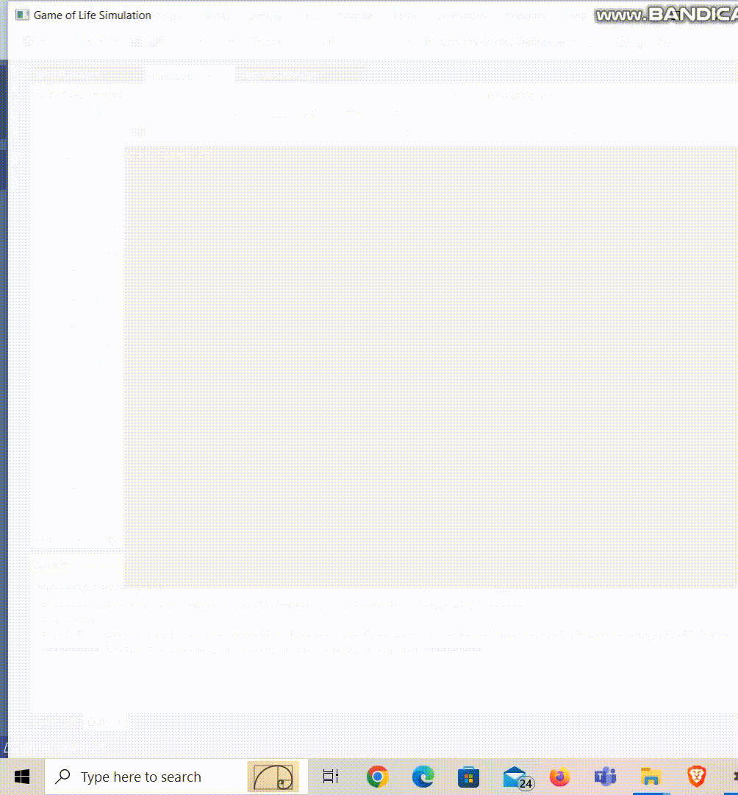

# GameOfLife

## Compilation of MPI and OpenMP source code
In the project directory, run the following command:
```
./build.sh compile
```

The ***build.sh*** script compiles the source code using the following command:
```
mpicc -O -o $OUTPUT_BINARY $SOURCE_FILES -lm -fopenmp
```
The enviroment variables ***OUTPUT_BINARY*** and ***SOURCE_FILES*** are defined in the ***build.sh*** script. The executable named ***game_of_life*** will be created in the bin folder.

The binary and output files can be removed by running:
```
./build.sh clean
```

## Submit job to HPC cluster using SLURM
The ***submit.sl*** file contains the SLURM script to submit the job to the HPC cluster. The script can be modified to change the number of nodes, number of tasks per node, number of threads per task, etc. It uses the following command to run the simulation:
```
mpirun -bind-to none -n no_of_procs ./bin/game_of_life -l number_of_iterations -n grid_size -i input_file_name -o output_file_name
```
The script can be submitted to the cluster using the following command:
```
sbatch submit.sl
```
Post completion of the job, the output file will be created, and the program output will be written in ***game_of_life.out***.

## Simulation Patterns

### Overview
In this documentation, videos of various patterns in Conway's Game of Life are included, all rendered using OpenGL for enhanced graphical representation. These include demonstrations of patterns using both predefined and random input files across different grid sizes. The focus is on the following primary pattern types:

#### Still Lifes
- **Definition**: Stable patterns that do not change over generations, symbolizing equilibrium.
- **Examples**: 
  - Block
  - Beehive
  - Loaf
  - Boat
- 

#### Oscillators
- **Definition**: Patterns that return to their initial state after a finite number of generations, depicting periodic behavior.
- **Examples**: 
  - Pulsar
- 

#### Spaceships
- **Definition**: Patterns that move across the grid, maintaining their shape but changing location, demonstrating motion.
- **Examples**: 
  - Glider (diagonally moving)
- 
  - MSM Breeder
- 
  

#### Visualization of Patterns with Random Inputs

### Grid Size: 16x16
- 

### Grid Size: 32x32
- 

### Grid Size: 64x64
- 

### Grid Size: 128x128
- 

### Grid Size: 256x256
- 


